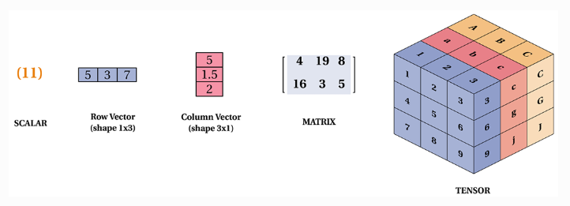

# PyTorch Fundamentals: Your First Steps into Hands-on Deep Learning

## Overview  
Introduction to PyTorch fundamentals, covering tensor initialization, operations, indexing, and reshaping.



## Install Dependencies
```
pip install -r requirements.txt
```
If you're installing torch with CUDA support, make sure to use the correct installation command from [PyTorch's official website](https://pytorch.org/get-started/locally/), as some versions require a specific installation method.

## Contents

- What are Tensors?
- Tensor Initialization
- Common Tensor Initialization Methods
- Tensor Type Conversion
- Converting Between NumPy Arrays and Tensors
- Tensor Mathematics and Comparison Operations
- Matrix Multiplication and Batch Operations
- Broadcasting and Other Useful Operations
- Tensor Indexing
- Tensor Reshaping

## Code Notebook

Dive into the hands-on examples in this interactive [Jupyter notebook](pytorch_fundamentals.ipynb). 

## Blog Post

Read the full breakdown and insights in the accompanying [blog post](https://awesomeneuron.substack.com/p/pytorch-fundamentals-your-first-steps).

## Contribution

- Fork the repo
- Create a new branch
- Make your changes
- Submit a Pull Request

## License

This project is licensed under [MIT License](./LICENSE)